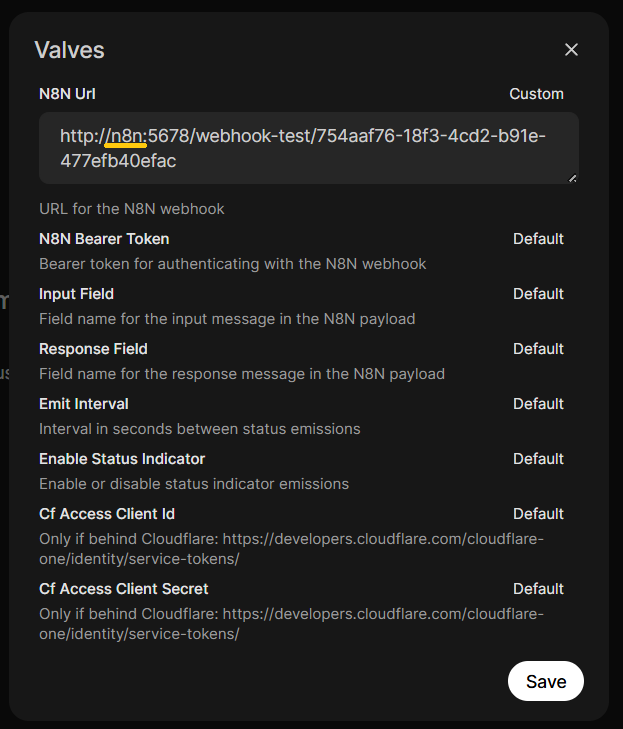

## Requisitos Previos

Actualización del Sistema
```sh
sudo apt update
sudo apt upgrade
```

Instalación de Python
```sh
sudo apt install python python3-pip python3-venv
```

Instalación de Docker
```sh
sudo apt install docker.io
sudo systemctl enable docker
sudo systemctl start docker
docker --version
```

Instalación de Docker-Compose
```sh
sudo curl -L "https://github.com/docker/compose/releases/latest/download/docker-compose-$(uname -s)-$(uname -m)" -o /usr/local/bin/docker-compose
sudo chmod +x /usr/local/bin/docker-compose
docker-compose --version
```

## Puesta en Marcha

### Clonación del Repositorio
```sh
git clone git@github.com:danunziata/pps-kevin_haponiuk-2025.git
cd pps-kevin_haponiuk-2025/src/self-hosted-ai-starter-kit
```

### Ejecución con Docker Compose
El proyecto soporta dos perfiles de ejecución según el hardware disponible:

| Perfil | Comando | 
|--------|---------|
| **CPU** | `docker compose --profile cpu up` |
| **GPU NVIDIA (recomendado)** | `docker compose --profile gpu-nvidia up` | 

### Descarga de Modelos en Ollama
```sh
# Acceder al contenedor de Ollama
docker exec -it ollama bash

# Descargar modelos necesarios
ollama run llama3.1:8b
ollama run gemma3:1b
ollama run qwen3:8b
ollama pull nomic-embed-text
```

**Nota**: Al finalizar cada ejecución de modelo, salir con `/bye`.

## Configuración de Servicios

### N8N
1. Acceder a [http://localhost:5678](http://localhost:5678)
2. Configurar credenciales locales:
      - Email: prueba@gmail.com
      - First Name: Prueba
      - Last Name: Prueba
      - Password: Prueba123
3. Verificar que aparezca el workflow "Agent-AI-PPS_Kevin-Haponiuk"... Si no aparece, importar desde: `pps-kevin_haponiuk-2025/src/self-hosted-ai-starter-kit/n8n/backup/workflows/Agent-AI-PPS_Kevin-Haponiuk.json`

### Credenciales de Google
Configurar las credenciales de Google siguiendo la [guía de instalación](../../pruebas/01_install-n8n/#credenciales-de-google).

### Verificación de GROBID
1. **Prueba desde navegador**: [http://localhost:8070/api/isalive](http://localhost:8070/api/isalive) debe retornar `true`
2. **Prueba desde N8N**: Ejecutar el bloque "TEST GROBID" para verificar la conectividad

## Procesamiento de Datos

### Carga de Información
1. Configurar la carpeta de PDFs en el bloque "Search all Content"
2. Ejecutar el workflow "CARGA DE INFORMACIÓN" en N8N
3. Verificar la carga en [http://localhost:6333/dashboard#/collections](http://localhost:6333/dashboard#/collections)

### Configuración de PostgreSQL
Obtener la IP del servicio de postgres:
```sh
docker inspect -f '{{range .NetworkSettings.Networks}}{{.IPAddress}}{{end}}' self-hosted-ai-starter-kit-postgres-1
```

Configurar credenciales del nodo de Postgres en N8N:

   - Host: [IP obtenida]
   - Database: n8n
   - Username: root
   - Password: password

### PgAdmin (Opcional)
1. Acceder a [http://localhost:5050/](http://localhost:5050/)
2. Login: admin@admin.com / admin
3. Agregar nuevo servidor con la IP de postgres y mismos parámetros utilizados en el punto anterior.

## Consulta al Agente

Existen dos formas de interactuar con el agente:

1. **Chat directo**: Usar el bloque "when chat message received" en N8N
2. **Webhook con OpenWebUI**: Configurar integración externa

### Configuración de OpenWebUI

Para poder hacer la consulta al agente mediante el bloque webhook, debemos configurar el servicio de OpenWebUI.

1. **Acceder a OpenWebUI**: Ir a `http://localhost:3000` y logearse con un mail y password.

2. **Crear nueva función**: Ir abajo a la izquierda y entrar al **Admin Panel** → **Functions** y crear una nueva función.

3. **Código de la función**: Copiar el siguiente código en la función:

    ```python
    # Código completo disponible en: src/self-hosted-ai-starter-kit/n8n-pipeline-function.py
    ```

4. **Configurar parámetros**: Configure los siguientes parámetros en la función creada:

      - **Nombre**: "N8N Pipeline" 
      - **Descripción**: "Pipeline para interactuar con N8N"

5. **Acceder al bloque Webhook**: En N8N, localice y configure el bloque Webhook de la siguiente manera (copie el Test URL generado):

<p align="center">
  
</p>

En las configuraciones de la función, utilice la URL copiada de N8N y realice el siguiente cambio:

   - Reemplace `localhost` por el nombre del contenedor de N8N (en este caso "n8n")
   - Mantenga el resto de configuraciones en valores por defecto

<p align="center">
  
</p>

**Activar el workflow**: Active el workflow en N8N para comenzar a recibir solicitudes:

<p align="center">
  
</p>

**Configurar escucha**: Configure el workflow para escuchar y recibir respuestas externas:

<p align="center">
  
</p>

### Verificación Final

Una vez completados todos los pasos anteriores, ya puede realizar consultas al agente directamente desde n8n o desde Open WebUI.

## 🛑 Detener la ejecución

```bash
# Para perfil CPU
docker compose --profile cpu down

# Para perfil GPU NVIDIA
docker compose --profile gpu-nvidia down
```

## Puertos Utilizados

| Servicio | Puerto |
|----------|--------|
| N8N | 5678 |
| Ollama | 11434 |
| PgAdmin | 5050 |
| Qdrant | 6333 |
| Qdrant Search | 5000 |
| PostgreSQL | 5432 |
| OpenWebUI | 3000 |
| Grobid | 8070 |
| Cadvisor | 8081 |
| Prometheus | 9090 |
| Grafana | 3001 |

