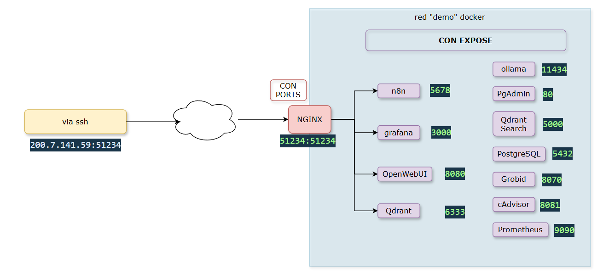
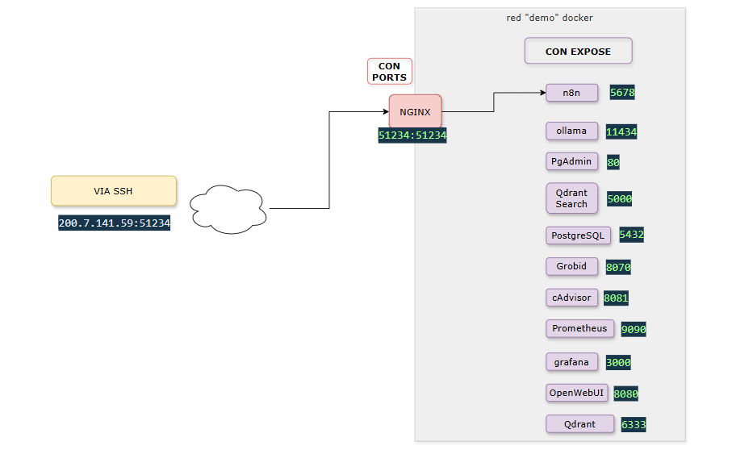
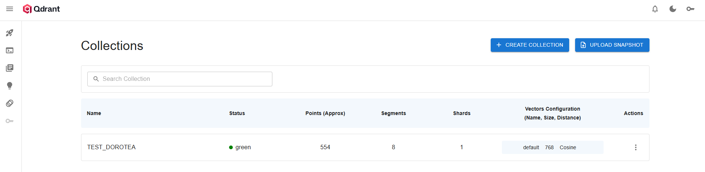
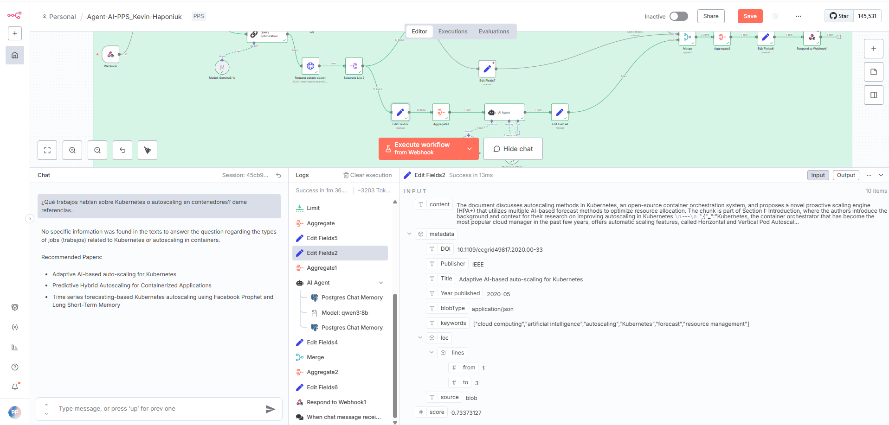
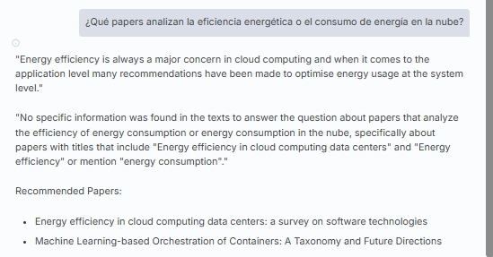
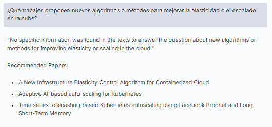
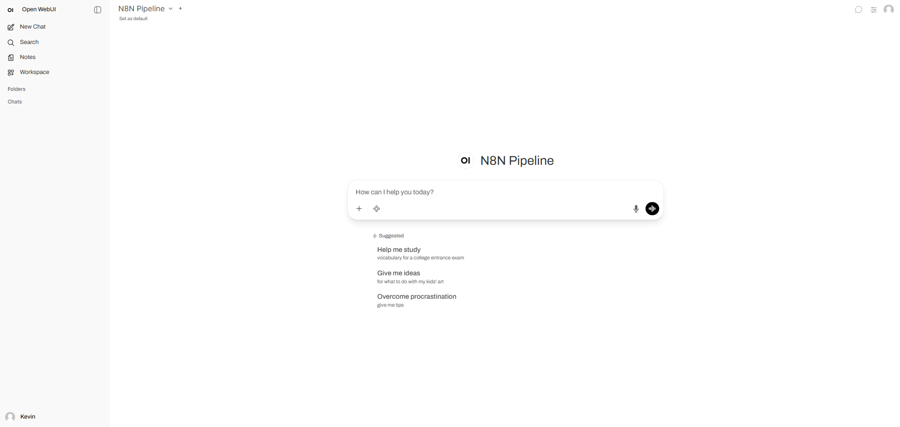
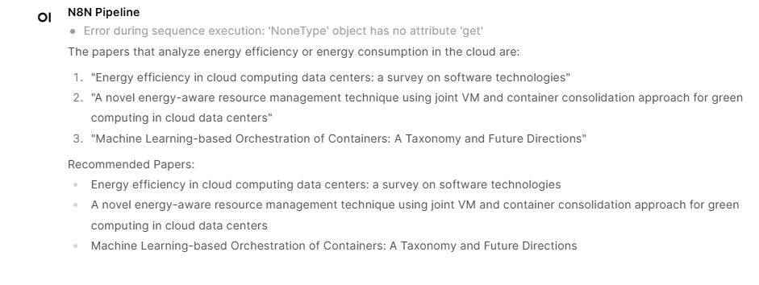
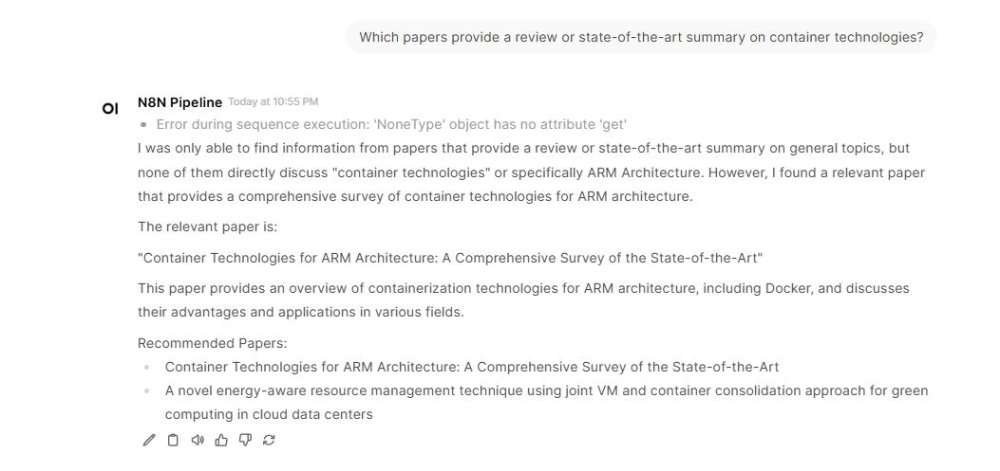

# Prueba en **Dorotea** — Ajustes de arquitectura y código

> **Objetivo.** Salir del entorno local y validar el stack en un servidor remoto de altas prestaciones (Dorotea) sin exponer puertos públicos; mantener acceso seguro vía **SSH** y dejar todo listo para pruebas de carga y funcionales.

---

## Requisitos Previos: Drivers de NVIDIA Instalados en Rocky Linux

El servidor debe tener los drivers propietarios de NVIDIA funcionando correctamente. Para verificarlo, ejecuta este comando:

```bash
nvidia-smi
```

Si ves una tabla con los detalles de tu GPU, est√°s listo. Si te da un error, necesitas instalar los drivers primero.

### Docker Instalado
Debes tener una instalación funcional de Docker. Puedes verificarlo con:

```bash
docker --version
```

---

### Paso 1: Configurar los Repositorios de NVIDIA
Rocky Linux no sabe dónde encontrar el toolkit por defecto. Primero, debemos agregar los repositorios oficiales de NVIDIA a nuestro sistema.

```bash
sudo dnf config-manager --add-repo https://nvidia.github.io/libnvidia-container/stable/rpm/nvidia-container-toolkit.repo
```

### Paso 2: Instalar el NVIDIA Container Toolkit
Ahora que el sistema conoce el repositorio, puedes instalar el paquete usando dnf.

```bash
sudo dnf install -y nvidia-container-toolkit
```

### Paso 3: Configurar Docker para que Use el Toolkit
Una vez instalado, tienes que decirle a Docker que lo utilice como un "runtime" para GPUs. El toolkit incluye una herramienta para hacer esto autom√°ticamente.

```bash
sudo nvidia-ctk runtime configure --runtime=docker
```

Después de configurar, es crucial reiniciar el servicio de Docker para que aplique los cambios.

```bash
sudo systemctl restart docker
```

### Paso 4: Verificar la Instalación ✅
La mejor forma de confirmar que todo funciona es ejecutar un contenedor de prueba que intente acceder a la GPU. El siguiente comando es el est√°ndar para esta prueba:

```bash
docker run --rm --gpus all nvidia/cuda:12.0.0-base-ubuntu22.04 nvidia-smi
```

---

## Resumen de la evolución de la arquitectura

### Opción 1: NGINX → 4 servicios (ideal)

<p align="center">
  
</p>

  Un solo puerto expuesto por **NGINX** y, detr√°s, 4 servicios accesibles por **subpath**:

    - `/` ‚Üí n8n
    - `/grafana/` ‚Üí Grafana
    - `/webui/` ‚Üí OpenWebUI
    - `/qdrant/` ‚Üí Qdrant

Ventaja: 1 t√∫nel SSH, una √∫nica puerta de entrada y URLs limpias.


* **Problemas encontrados**

  * **WebSockets/SSE de n8n**: el proxy requería `proxy_http_version 1.1`, headers `Upgrade/Connection` y timeouts altos. Sin eso, fallaban eventos del editor y la UI mostraba “Could not connect to server”.
  * **Subpath**:

    * **Grafana** requiere `GF_SERVER_ROOT_URL` apuntando al subpath y `GF_SERVER_SERVE_FROM_SUB_PATH=true`. Aun con eso, aparecieron 301/redirects a `/grafana` y recursos est√°ticos fuera del path.
    * **OpenWebUI** sirve assets en rutas absolutas; al forzarlo bajo `/webui/` faltaban archivos (`/static/splash.png` 404) y la UI quedaba en blanco salvo el loader.

---

### Opción 2: solamente NGINX -> N8N (transición)

* 1 puerto ‚Üí NGINX ‚Üí **solo n8n** en `/`.
<p align="center">
  
</p>

### Opción 3: 4 puertos vía SSH (implementada)


<p align="center">
  
</p>

Se abren **t√∫neles locales** (sin puertos p√∫blicos):

```bash
ssh -i ~/.ssh/dorotea-kevin -L 51234:localhost:51234 daninziata@200.7.141.59
ssh -i ~/.ssh/dorotea-kevin -L 51235:localhost:51235 daninziata@200.7.141.59
ssh -i ~/.ssh/dorotea-kevin -L 51236:localhost:51236 daninziata@200.7.141.59
ssh -i ~/.ssh/dorotea-kevin -L 51237:localhost:51237 daninziata@200.7.141.59
```

Con esto:

* `http://localhost:51234` ‚Üí **n8n** (pasa por NGINX)
* `http://localhost:51235` ‚Üí **Grafana**
* `http://localhost:51236` ‚Üí **OpenWebUI**
* `http://localhost:51237/dashboard#/collections` ‚Üí **Qdrant** (dashboard)

---
## Principales diferencias **ANTES** vs **DESPUÉS**

### Ajustes de NGINX para utilizar n8n en la raíz (`/`)

El proxy quedó ajustado para **WebSockets/SSE** y **conexiones largas**:

* `proxy_http_version 1.1`
* `Upgrade` / `Connection "upgrade"`
* timeouts altos (`proxy_read_timeout`, `proxy_send_timeout`)
* `proxy_buffering off` para *server-sent events* (SSE)

Con estos ajustes, el editor de n8n dejó de mostrar errores de conexión y pudo autenticarse y trabajar con normalidad detrás del proxy.


### Cambio de almacenamiento (limitación de `/var`)

**Contexto.** El servidor tiene:

```
/dev/mapper/vg_server-lv_root   79G   49G   30G  62%  /
/dev/nvme1n1p1                   7T  398G  6.2T   6%  /home
```

El *runtime* de Docker por defecto escribe en **`/var/lib/docker`** (dentro de `/`), lo que **r√°pidamente agotaba espacio**, especialmente al descargar **modelos de Ollama** y datos persistentes.

**Acción.** Se reemplazaron **volúmenes nombrados** por **bind mounts** hacia **`/home`**:

* Postgres ‚Üí `/home/daninziata/docker_data/postgres`
* Grafana ‚Üí `/home/daninziata/docker_data/grafana`
* OpenWebUI ‚Üí `/home/daninziata/docker_data/openwebui`
* Qdrant ‚Üí `/home/daninziata/docker_data/qdrant`
* Prometheus ‚Üí `/home/daninziata/docker_data/prometheus`
* **Ollama (modelos)** ‚Üí `/home/daninziata/ollama_data`

**Resultado.** Todo lo pesado sale de `/var` y pasa al disco grande de **7 TB**, eliminando errores por falta de espacio.

### Networking

**Antes:** muchos servicios con `ports:` publicados hacia el host.

**Después:**

  - **n8n** permanece detr√°s de **NGINX** (publicado en `51234`).
  - **Grafana**, **OpenWebUI** y **Qdrant** se publican en **puertos altos** (51235/51236/51237) sólo para **túneles SSH**.
  - Servicios internos (Postgres, Prometheus, cAdvisor, etc.) usan **`expose`** dentro de la red `demo` y no se publican al host.

### Persistencia

* **Antes:** vol√∫menes **nombrados** (`grafana_data`, `prometheus_data`, etc.).
* **Después:** **bind mounts** a rutas en `/home/daninziata/...` para cada servicio, y **`/home/daninziata/ollama_data`** para los modelos.

### Nombres/hosts

* **Antes:** contenedores cortos (`ollama`, `qdrant`).
* **Después:** sufijo `-k` para distinguir el despliegue remoto (ej. `ollama-k`, `qdrant-k`, `nginx-proxy-k`, etc.). Las apps que dependen por URL se actualizaron (ej. `OLLAMA_HOST=ollama-k:11434`).

---

### Monitoreo: cAdvisor + Prometheus

* **Síntoma inicial en Prometheus:**
  `connect: connection refused` al intentar scrapear `cadvisor-k:8081/metrics`.


**Causa:** El contenedor cAdvisor **escucha en 8080**, pero el *job* de Prometheus apuntaba a **8081**.

**Arreglo aplicado:**

  * En Compose: `cadvisor` con `expose: "8080"`.
  * En Prometheus: job `cadvisor` ‚Üí `targets: ['cadvisor-k:8080']`.

---

### Servicio **qdrant-search** (Flask + Qdrant Client + Ollama)

**Par√°metros por variables de entorno** (en Compose):

  * `OLLAMA_URL=http://ollama-k:11434`
  * `QDRANT_URL=http://qdrant-k:6333`
  * `COLLECTION_NAME=TEST_DOROTEA`

> **Importante:** Si se cambia el nombre de **colección**, hay que **reconstruir** la imagen para propagar variables al contenedor:

> ```bash
    docker compose build --no-cache qdrant-search
    docker compose up -d qdrant-search
    docker exec -it qdrant-search-k sh
    cat /app/client_qdrant_flask_docker.py | grep collection_name
> ```

El microservicio devolvía `Not found: Collection 'prueba_CRAG3' doesn’t exist!` aun cuando `COLLECTION_NAME=TEST_DOROTEA`. **Causa**: el contenedor estaba corriendo con **capa antigua** (variables de una build previa). **Solución**: **rebuild** del servicio. Tras eso, las consultas desde n8n y desde la red Docker funcionaron.

### GPU y modelos (Ollama)

* **Verificación** de uso de GPU con `nvidia-smi`: durante generación se observó `GPU-Util 100%` en la **A30** y consumo de **VRAM** acorde a los modelos cargados. Sin embargo, solo en una de las 2 placas. también se observó que 

<p align="center">
  
</p>

Logs de Ollama mostraron `loaded CUDA backend`, “VRAM available/required” y selección de **GPULayers**, confirmando aceleración CUDA.
**Mensaje “truncating input prompt (limit=4096)”**: es el **límite de contexto** del modelo en **tokens**. Si el *prompt* (incluida la conversación previa) lo supera, Ollama lo recorta. Mitigación: prompts más breves o modelos con mayor contexto (cuando estén disponibles).

## Resultados de las pruebas funcionales en Dorotea

> **Objetivo:** Validar el funcionamiento integral del stack con aceleración GPU, recolección de métricas en Grafana y generación de embeddings mediante Ollama y Qdrant, utilizando la colección `TEST_DOROTEA` como caso de prueba.

---

### 1. Pruebas de carga — Uso extremo de CPU (Profile CPU)

Durante la primera etapa de las pruebas se intentó ejecutar un perfil intensivo del modelo (`Profile CPU`), pero el proceso **saturó completamente los núcleos** de la máquina, llevando el uso de CPU al 100% en todos los hilos.

El proceso fue ejecutado desde Ollama (`/usr/bin/ollama runner`) con m√∫ltiples hilos en paralelo, observ√°ndose que cada uno ejecutaba la carga de modelo en puertos independientes (`--port 33137`).

> Este test quedó en ejecución continua sin completar, por lo que se detuvo manualmente para evitar degradar el rendimiento del resto de los contenedores.

<p align="center">
  
</p>

---

### 2. Monitoreo con Grafana y cAdvisor

Durante la ejecución se dejó **Grafana activo** con los dashboards de Prometheus y cAdvisor recolectando métricas en tiempo real de todos los contenedores.

El monitoreo permitió observar:

* N√∫mero de contenedores activos: **13**
* Procesos m√°s demandantes de CPU:
  - `grobid-k` (36.6%)
  - `cadvisor-k` (10.9%)
  - `pgadmin-k`, `n8n-k`, `prometheus-k` en menor proporción
* Consumo de memoria: promedio general bajo, sin indicios de *swapping* ni saturación.

> Estos datos validan que el entorno completo puede ejecutarse de manera estable durante largos periodos, incluso con procesos intensivos como el parsing de papers o la generación de embeddings.

<p align="center">
  
</p>

---

### 3. Carga de datos — Creación de la colección `TEST_DOROTEA`

Tras estabilizar el entorno, se procedió a realizar una carga de **10 papers científicos** en formato JSON procesados por el pipeline Grobid → Ollama → Qdrant.

**Duración total del proceso:** aproximadamente **2 horas**.

Esto sugiere que el cuello de botella podría encontrarse en:

* **Procesamiento de embeddings** dentro de Ollama (`nomic-embed-text`).
* **Paralelización limitada** o falta de optimización en la inserción de datos en Qdrant.

> Se recomienda analizar en profundidad la arquitectura de Ollama (modelos, batch size, n√∫mero de workers) para reducir los tiempos de carga en pruebas futuras.

#### Resultado:

La colección `TEST_DOROTEA` se creó correctamente, con estado **green** y **554 puntos vectoriales** distribuidos en **8 segmentos**.

<p align="center">
  
</p>

---

### 4. Visualización de la colección en Qdrant

La exploración de la colección en la interfaz de Qdrant mostró una **distribución coherente** de los embeddings en el espacio vectorial, confirmando que los puntos fueron generados correctamente y los metadatos (contenido, fuente, etc.) se mantienen accesibles.

<p align="center">
  
</p>

---

### 5. Pruebas de b√∫squeda sem√°ntica

Una vez creada la colección, se probaron distintas consultas al agente a través de `qdrant-search-k`, verificando que las respuestas generadas correspondían a la semántica de las preguntas y retornaban papers relevantes.

#### üîπ **Consulta 1**

<p align="center">
  
</p>

**Pregunta:** ¿Qué trabajos hablan sobre Kubernetes o autoscaling en contenedores?

**Respuesta del agente:**

> No specific information was found in the texts to answer the question regarding the types of jobs (trabajos) related to Kubernetes or autoscaling in containers.  
>
> **Recommended Papers:**
>
> - Adaptive AI-based auto-scaling for Kubernetes  
> - Predictive Hybrid Autoscaling for Containerized Applications  
> - Time series forecasting-based Kubernetes autoscaling using Facebook Prophet and Long Short-Term Memory

---

#### üîπ **Consulta 2**

<p align="center">
  
</p>

**Pregunta:** Dame referencias sobre los papers que mencionan MLOps o pipelines de machine learning.

**Respuesta del agente:**

> Here are the references to papers that mention MLOps or pipelines in machine learning:  
>
> - "MLOps: A Taxonomy and a Methodology"  
> - "Towards MLOps: A Case Study of ML Pipeline Platform"  
> - "MLOps: A Taxonomy and a Methodology"  
> - "MLOps: A Taxonomy and a Methodology"  
> - "MLOps: A Taxonomy and a Methodology"  
>
> These papers provide an overview of the MLOps methodology, its importance, and its application in industrial environments. They also discuss various aspects of MLOps, including pipelines, DevOps principles, and benchmarking tools.  
>
> The papers also mention other relevant topics such as:  
>
> - Machine Learning Operations (MLOps)  
> - ML pipeline platforms  
> - CI/CD routines  
> - Automated ML triggering  
> - Model registry storage  
> - Monitoring and performance  
>
> You can find more information about these papers by accessing the references provided in the database results.  
>
> **Recommended Papers:**  
>
> - MLOps: A Taxonomy and a Methodology  
> - Towards MLOps: A Case Study of ML Pipeline Platform

---

#### üîπ **Consulta 3**

<p align="center">
  
</p>

**Pregunta:** ¿Qué papers analizan la eficiencia energética o el consumo de energía en la nube?

**Respuesta del agente:**

> "Energy efficiency is always a major concern in cloud computing and when it comes to the application level many recommendations have been made to optimise energy usage at the system level."  
>
> "No specific information was found in the texts to answer the question about papers that analyze the efficiency of energy consumption or energy consumption in the nube, specifically about papers with titles that include "Energy efficiency in cloud computing data centers" and "Energy efficiency" or mention "energy consumption"."  
>
> **Recommended Papers:**  
>
> - Energy efficiency in cloud computing data centers: a survey on software technologies  
> - Machine Learning-based Orchestration of Containers: A Taxonomy and Future Directions

---

#### üîπ **Consulta 4**

<p align="center">
  
</p>

**Pregunta:** ¿Cuáles de los papers hacen una revisión o resumen del estado del arte sobre tecnologías de contenedores?

**Respuesta del agente:**

> No specific information was found in the texts to answer the question about papers that analyze the efficiency of energy consumption or energy consumption in the nube.  
>
> **Recommended Papers:**  
>
> - Container Technologies for ARM Architecture: A Comprehensive Survey of the State-of-the-Art  
> - A novel energy-aware resource management technique using joint VM and container consolidation approach for green computing in cloud data centers

---

#### üîπ **Consulta 5**

<p align="center">
  
</p>

**Pregunta:** ¿Qué trabajos proponen nuevos algoritmos o métodos para mejorar la elasticidad o el escalado en la nube?

**Respuesta del agente:**

> "No specific information was found in the texts to answer the question about new algorithms or methods for improving elasticity or scaling in the cloud."  
>
> **Recommended Papers:**  
>
> - A New Infrastructure Elasticity Control Algorithm for Containerized Cloud  
> - Adaptive AI-based auto-scaling for Kubernetes  
> - Time series forecasting-based Kubernetes autoscaling using Facebook Prophet and Long Short-Term Memory


## Test usando OpenwebUI + Preguntas en inglés

Una vez dentro de OpenwebUI, el primer paso es configurar el Pipe que se utilizará. Para ello, sigue los pasos explicados en el archivo [`01_implementacion-final.md`](./01_implementacion-final.md). La única diferencia en este caso fue el código empleado para configurar el Pipe, que se encuentra en [`DOCUMENTACION/pps-kevin_haponiuk-2025/src/self-hosted-ai-starter-kit/n8n-pipeline-function-dorotea.py`].

<p align="center">
  
</p>

Las preguntas realizadas fueron las mismas que en pruebas anteriores, pero esta vez en inglés.

**Which papers discuss Kubernetes or autoscaling in containers?**

<p align="center">
  
</p>

**Provide references to papers that mention MLOps or machine learning pipelines.**

<p align="center">
  
</p>

En este caso, se realizó la misma pregunta por segunda vez, ya que la primera respuesta fue algo imprecisa. Esto permitió observar cómo se comporta el sistema al repetir una consulta.

<p align="center">
  
</p>

**Which papers analyze energy efficiency or energy consumption in the cloud?**

<p align="center">
  
</p>

**Which papers provide a review or state-of-the-art summary on container technologies?**

<p align="center">
  
</p>

**Which papers propose new algorithms or methods to improve elasticity or scaling in the cloud?**

<p align="center">
  
</p>

Es importante destacar que las respuestas del agente mejoraron significativamente al realizar las preguntas en inglés. Esto se debe a que el modelo de Ollama está entrenado principalmente en inglés, lo que optimiza la calidad y precisión de las respuestas.

## Conclusiones

1. **El pipeline completo operó de manera estable**, abarcando desde la extracción y análisis de los papers hasta la indexación vectorial y la consulta semántica.
   
2. **El rendimiento general fue satisfactorio**, aunque la carga inicial de datos resultó **lenta (≈2 horas para 10 documentos)**, indicando posibles cuellos de botella en el procesamiento de embeddings o la inserción en Qdrant.
   
3. **Las respuestas del agente fueron semánticamente relevantes**, con sugerencias precisas y papers correctamente asociados, validando el correcto funcionamiento de los embeddings y la búsqueda vectorial en Qdrant. Además, se observó que el agente mejora significativamente sus respuestas cuando las preguntas se formulan en inglés, debido a que el modelo de Ollama está entrenado principalmente en este idioma. Esto optimiza la calidad y precisión de las respuestas, haciendo que las consultas sean más efectivas.
   
4. Se recomienda explorar optimizaciones en:
      * **Uso de GPU en Ollama**: mejorar la paralelización durante la generación de embeddings.
      * **Segmentación del proceso de carga**: dividir tareas para reducir tiempos.
      * **Modelos alternativos**: evaluar arquitecturas m√°s eficientes para embeddings masivos.

> La infraestructura desplegada en Dorotea demostró ser robusta, con capacidad de procesamiento adecuada y un rendimiento aceptable para pruebas de investigación y desarrollo, así como para futuras escalas.

---

## Trabajo futuro

1. **Migrar a la Opción 1**: Consolidar los servicios detrás de un único puerto y 4 subpaths en NGINX para simplificar el acceso y mejorar la organización.

2. **Fortalecer la seguridad**:
      * Implementar autenticación en NGINX o integrar un sistema de inicio de sesión único (SSO).
      * Configurar **TLS end-to-end** si se planea exponer los servicios m√°s all√° del t√∫nel SSH (actualmente suficiente para pruebas internas).

3. **Optimizar el pipeline**:
      * Analizar el uso de GPU en Ollama para maximizar la eficiencia.
      * Evaluar herramientas o técnicas para acelerar la carga de datos en Qdrant.
      * Considerar modelos con mayor capacidad de contexto para mejorar las respuestas sem√°nticas.

4. **Monitoreo avanzado**:
      * Ampliar los dashboards en Grafana para incluir métricas específicas de GPU y rendimiento de embeddings.
      * Automatizar alertas para detectar posibles cuellos de botella o fallos en tiempo real.