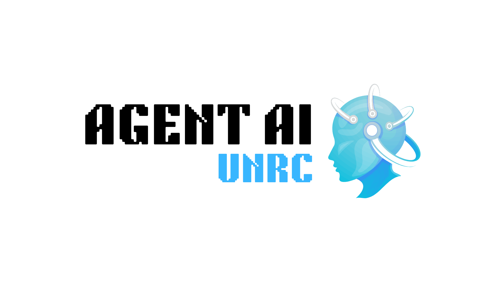

# Agente de Inteligencia Artificial para Investigación Científica

  

El proyecto busca diseñar e implementar un agente de inteligencia artificial (IA) para la recomendación y asistencia en investigación científica, utilizando herramientas de código abierto que permitan optimizar la búsqueda, clasificación y análisis de literatura científica. Para su desarrollo, se relevarán tanto herramientas tecnológicas como metodologías y estrategias utilizadas en los procesos de investigación con el fin de diseñar los flujos de trabajo (pipelines) adecuados. Este agente servirá como una herramienta clave en el ámbito académico, facilitando el acceso, la organización del conocimiento y la generación de recomendaciones personalizadas.

## Fundamentos

La implementación de un sistema de recomendaciones basado en inteligencia artificial representa una oportunidad estratégica para modernizar la investigación científica, optimizar procesos y mejorar la interacción de los investigadores con la literatura académica. Este proyecto se centra en tres aspectos clave:

- **Consulta inteligente** de documentación científica para investigadores.
- **Relevamiento de metodologías y estrategias** utilizadas en procesos de investigación para definir los pipelines del agente de IA.
- **Un agente de IA** que automatice la identificación de artículos relevantes, tendencias y conexiones entre investigaciones.

El acceso rápido y preciso a la información es esencial para la investigación científica. Sin embargo, el volumen y la complejidad de la literatura académica dificultan la búsqueda y selección de material relevante. Un agente inteligente de IA permitirá la consulta rápida y precisa de publicaciones científicas, mejorando la toma de decisiones en el desarrollo de nuevos estudios y optimizando el tiempo invertido en revisiones bibliográficas. Además, su diseño estará basado en el relevamiento de metodologías utilizadas en los procesos de investigación, asegurando que los pipelines diseñados reflejen las necesidades reales de los investigadores.

Este sistema automatizado permitirá mejorar la eficiencia operativa mediante la reducción de tiempos de búsqueda y la organización inteligente del conocimiento. También contribuirá a una mayor eficiencia en la planificación de nuevas investigaciones al identificar vacíos en la literatura y conectar estudios relevantes de manera automatizada.

La implementación de este agente de IA abre nuevas oportunidades significativas. En primer lugar, busca mejorar la productividad de los investigadores al facilitar el acceso a información clave sin necesidad de búsquedas manuales extensivas. En segundo lugar, fomentará la colaboración interdisciplinaria al sugerir trabajos relacionados en diversas áreas del conocimiento. Además, un sistema accesible y eficiente incentivará una mayor integración de la inteligencia artificial en el ámbito científico, promoviendo la innovación en metodologías de investigación. Finalmente, se contempla que el sistema tenga un enfoque de diseño escalable y adaptable a futuras necesidades, asegurando su relevancia a largo plazo.

## Objetivos Generales

Desarrollar un agente de inteligencia artificial que asista a investigadores en la revisión bibliográfica y generación de recomendaciones científicas, optimizando la búsqueda, selección y análisis de literatura académica.

## Objetivos Específicos

- Realizar un relevamiento de herramientas de código abierto para evaluar su aplicabilidad en el procesamiento de información científica y la automatización de flujos de trabajo.
- Analizar metodologías y estrategias utilizadas en procesos de investigación, identificando los requerimientos clave para diseñar pipelines de automatización eficientes.
- Definir la arquitectura del agente de IA, estableciendo modelos de procesamiento de lenguaje natural, flujos de datos y esquemas de integración con bases de datos científicas.
- Desarrollar y entrenar al agente, optimizando su capacidad de extracción, clasificación y recomendación de información académica.
- Implementar estrategias de automatización de tareas, asegurando una integración fluida con herramientas de gestión de información.
- Evaluar el desempeño del sistema, aplicando métricas de precisión, recall y relevancia en la recomendación de contenido científico.
- Diseñar una interfaz intuitiva, que permita a los investigadores interactuar de manera eficiente con el agente.
- Documentar el proceso de desarrollo e implementación, incluyendo configuraciones, pruebas y resultados.
