# ¿Cómo funciona un Modelo de Lenguaje Generativo? 🧠💬

Para poder desarrollar una solución efectiva, es fundamental comprender qué ocurre detrás de escena cuando le hacemos una solicitud a una inteligencia artificial de texto generativo como puede ser ChatGPT.

En esta sección vamos a desglosar y explicar, de forma simple y conceptual, los elementos esenciales que conforman un modelo de lenguaje generativo.

---

## ¿Qué es Machine Learning?

El *Machine Learning* es una rama de la inteligencia artificial que permite a las computadoras **aprender de los datos** sin que sea necesario programarlas explícitamente para cada tarea.

Una definición clásica lo describe así:

> *Machine Learning es el campo de estudio que da a las computadoras la capacidad de aprender sin ser explícitamente programadas.*  
> — Arthur Samuel, 1959

Otra, más enfocada en su aplicación, dice:

> *Un programa aprende de la experiencia (E), con respecto a una tarea (T) y una medida de rendimiento (P), si mejora su rendimiento en T, medido por P, gracias a E.*  
> — Tom Mitchell, 1997

### Un ejemplo cotidiano

Tomemos como ejemplo el **filtro de spam**. Este sistema analiza miles de correos que los usuarios marcaron como spam o no spam, y con eso **aprende a detectar patrones** para clasificar correctamente nuevos correos.  
Aquí:

- **Tarea (T):** Clasificar correos como spam o no spam.  
- **Experiencia (E):** Correos etiquetados por usuarios.  
- **Rendimiento (P):** Porcentaje de correos clasificados correctamente (precisión o *accuracy*).

Con suficiente experiencia, el sistema mejora su desempeño en la tarea, sin necesidad de reglas escritas por humanos.


### Tipos de aprendizaje en Machine Learning

- **Aprendizaje Supervisado**: Es como aprender a tocar el piano con un profesor. El algoritmo se entrena con datos etiquetados, es decir, con las respuestas correctas ya conocidas. Aprende comparando sus resultados con las respuestas reales y ajustando su comportamiento. Se utiliza, por ejemplo, en sistemas que filtran correos spam.

- **Aprendizaje No Supervisado**: Similar a armar un rompecabezas sin saber cómo debería verse al final. No se proporcionan etiquetas ni respuestas, y el algoritmo debe descubrir patrones o agrupaciones por sí mismo. Un uso común es la segmentación de clientes en marketing.

- **Aprendizaje por Refuerzo**: Como entrenar a una mascota con premios y castigos. El algoritmo aprende a través de prueba y error, recibiendo recompensas por buenas acciones y penalizaciones por errores. Es muy usado en videojuegos y robótica, donde el sistema mejora con la experiencia.

<p align="center">
  
  <br>
  <em>Figura 1: Tipos de aprendizajes en machine learning</em>
</p>

## ¿Qué es una red neuronal?

Las redes neuronales artificiales (*Artificial Neural Networks*, o ANN) son **modelos matemáticos inspirados en el funcionamiento del cerebro humano**.
Por medio de una colección de unidades llamadas *neuronas artificiales*, organizadas en capas y conectadas entre sí, que **aprende a realizar tareas complejas mediante la experiencia**, es decir, ajustando sus parámetros a partir de los datos de entrenamiento. Gracias a esta capacidad, pueden realizar tareas como clasificar imágenes, reconocer voz o jugar videojuegos, todo esto **aprendiendo a partir de datos**.

### Inspiración biológica

Una **neurona biológica** es una célula del cerebro que recibe señales de otras neuronas a través de estructuras llamadas *dendritas*, procesa esa información en el cuerpo celular, y transmite señales hacia otras neuronas a través del *axón*. Cuando recibe suficientes estímulos, la neurona "dispara" una señal eléctrica.

<p align="center">
  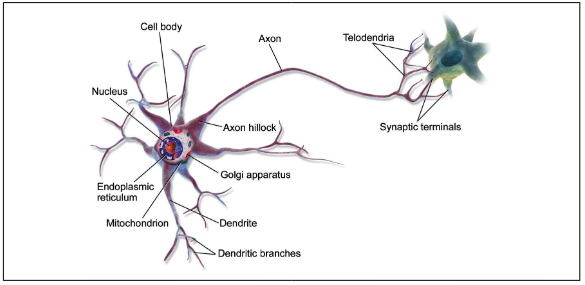
  <br>
  <em>Figura 2: Una neurona biológica</em>
</p>

<p align="center">
  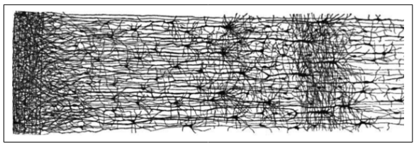
  <br>
  <em>Figura 3: Representación de una red neuronal humana</em>
</p>

De forma análoga, una **neurona artificial** recibe múltiples entradas numéricas (como los datos de una imagen o un texto), las combina mediante una función matemática y produce una salida. Las conexiones entre neuronas se representan con pesos, que determinan la importancia de cada entrada. Al entrenar la red, estos pesos se ajustan para mejorar el desempeño del modelo.


<p align="center">
  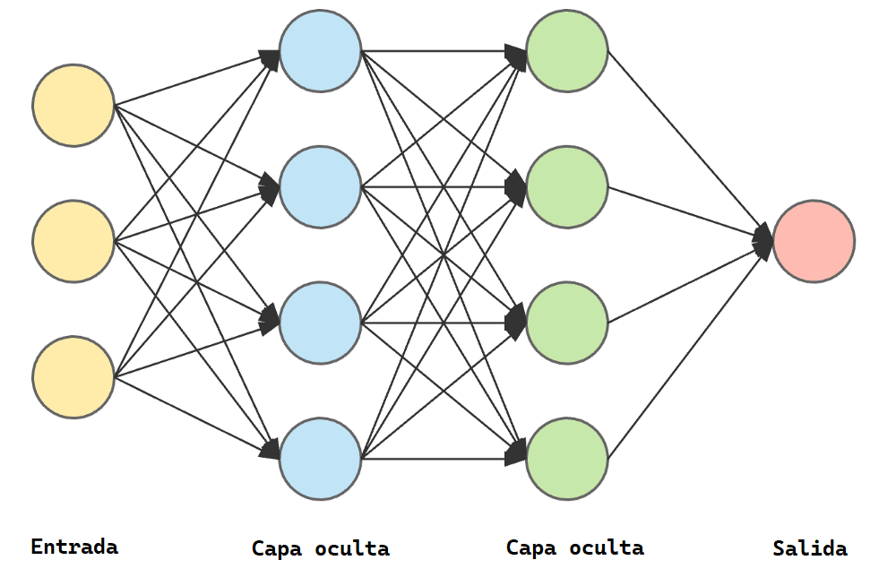
  <br>
  <em>Figura 4: Representación conceptual de una red neuronal artificial </em>
</p>

### Un poco de historia

Las primeras redes neuronales fueron propuestas en 1943 por **McCulloch y Pitts**, quienes crearon un modelo muy simplificado de neurona artificial capaz de realizar cálculos lógicos (como AND, OR y NOT). Este fue el punto de partida para una larga evolución.

Durante décadas, las redes neuronales pasaron por varios ciclos de entusiasmo y olvido, hasta que en la última década resurgieron con fuerza, gracias a:

- la disponibilidad de **grandes cantidades de datos** (Big Data),
- el aumento exponencial de la **capacidad de cómputo** (especialmente con GPUs y TPUs),
- y las mejoras en los **algoritmos de entrenamiento** (como el descenso por gradiente y sus variantes).

Todo esto permitió entrenar redes neuronales más profundas y complejas, dando lugar al auge de ia que hoy presenciamos.

## ¿Qué es un LLM?

Un **LLM** (*Large Language Model*, o *Modelo de Lenguaje Grande*) es un tipo de modelo de inteligencia artificial entrenado para comprender, generar y trabajar con lenguaje natural de manera fluida. Estos modelos están basados en redes neuronales profundas, especialmente en arquitecturas conocidas como **transformers** (explicado más adelante), que le permite procesar y generar texto a gran escala.

Lo que hace especial a un LLM es la enorme cantidad de datos con los que ha sido entrenado (normalmente textos provenientes de libros, artículos, páginas web y otros contenidos públicos) y la gran cantidad de parámetros que posee, muchas veces llegando a **miles de millones de conexiones**. Gracias a esto, los LLM pueden:

- Redactar textos coherentes y contextuales.
- Traducir entre distintos idiomas.
- Resumir documentos extensos.
- Responder preguntas de forma informada.
- Asistir en programación, análisis de datos, y mucho más.


## ¿Qué es el lenguaje natural y cómo puede interpretarlo la IA?

El **lenguaje natural** es la forma de comunicación que usamos los seres humanos en nuestra vida cotidiana, como el español, inglés, francés, etc. Se caracteriza por ser **rico, flexible y ambiguo**, y está lleno de matices culturales, contextuales y emocionales.

En el ámbito de la computación, cuando se habla de **procesamiento de lenguaje natural (NLP "Natural Language Processing", por sus siglas en inglés)**, se hace referencia a la capacidad de una máquina para **entender, interpretar, generar y responder** a textos o conversaciones escritos u orales del mismo modo en que lo haría una persona.

Cuando escribimos un texto como:

```
"El gato duerme en el sofá"
```

Este texto pasa por varios pasos para que la IA lo entienda:

### 1. Codificación numérica

Lo primero que debemos hacer es **convertir las palabras en un formato que la computadora pueda entender**, como por ejemplo una codificación numérica. Una forma sencilla de hacerlo es utilizando códigos como **ASCII**, donde a cada carácter se le asigna un número específico.


<p align="center">
  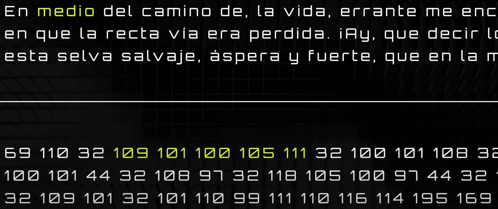
  <br>
  <em>Figura 5: Proceso de codificación</em>
</p>

### 2. Tokenización

A nuestra red neuronal la **entrenamos alimentándola con una gran cantidad de datos ya codificados**. A medida que procesa esta información, **aprende a reconocer patrones repetitivos** en el lenguaje. Estos patrones, conocidos como **tokens**, se van organizando y catalogando en una especie de vocabulario interno o lista, que luego usará para comprender y generar texto.


<p align="center">
  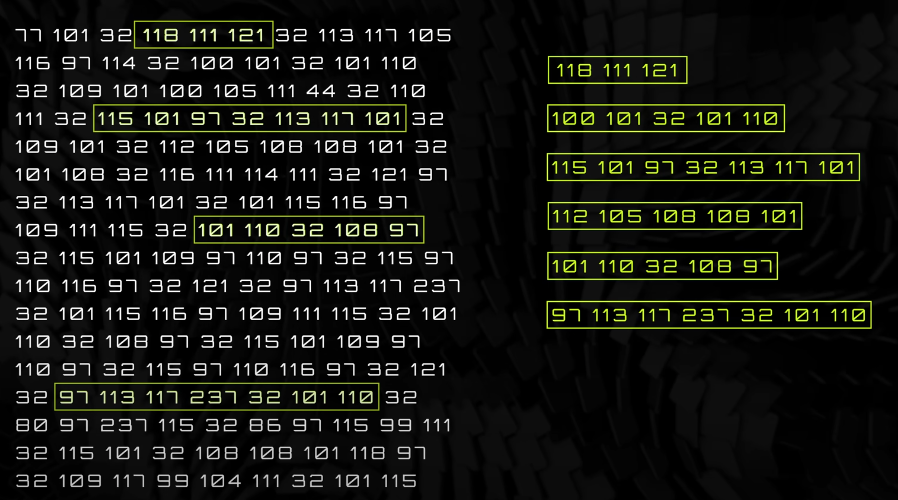
  <br>
  <em>Figura 6: Red neuronal encontrando patrones</em>
</p>


> 🔍 **Aclaración:** un *token* no es necesariamente una palabra. Puede ser una palabra completa, una parte de una palabra, o incluso un conjunto de palabras o símbolos, dependiendo del modelo y del sistema de tokenización utilizado.


### 3. Compresión

Una vez que nuestra red neuronal ha identificado los patrones en los datos, **el siguiente paso es representar cada token mediante un número o identificador único (ID)**. Esta conversión permite **simplificar el procesamiento y optimizar el almacenamiento**, ya que trabajar con números es mucho más eficiente que hacerlo directamente con texto.

Por ejemplo:

| Token      |Token completo   |  ID  |
|------------|-----------------|------|
| hola       | 72 111 108 97   | 1923 |
| hace       | 104 97 99 101   | 1234 |
| frío       | 102 114 237 111 | 6543 |

De esta forma, cuando la red procesa una frase como "hola hace frío", en realidad está trabajando internamente con una secuencia de números: `1923, 1234, 6543`.


<p align="center">
  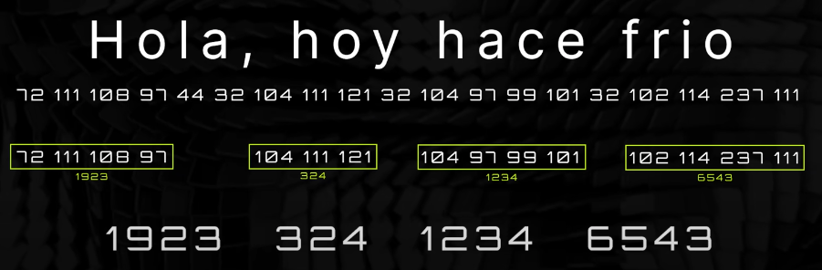
  <br>
  <em>Figura 7: Representación mediante ID</em>
</p>


### 4. Marcadores / Embedding

Es importante entender que **el modelo no "sabe" lo que significa cada palabra** como lo haría una persona. No tiene una comprensión semántica real de los términos. Sin embargo, **sí puede identificar qué tokens están relacionados entre sí** gracias a cómo se organizan en el espacio de embedding.

Por ejemplo, puede aprender que el token `"la"` aparece frecuentemente cerca de `"reina"`, y por eso los ubica **cerca en el espacio vectorial**. Esa proximidad representa una relación estadística, no un entendimiento real del lenguaje.

Esta capacidad de asociar términos según su contexto permite que el modelo genere texto coherente y mantenga el sentido general, aunque no comprenda el significado como lo haríamos nosotros.


<p align="center">
  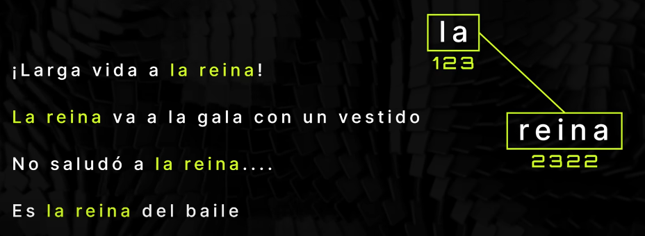
  <br>
  <em>Figura 8: Ejemplo de relación </em>
</p>

De esta manera, puedo encontrar relaciones entre los token y agregar una marca en cada ocasión que tengan relación entre ellos:

<p align="center">
  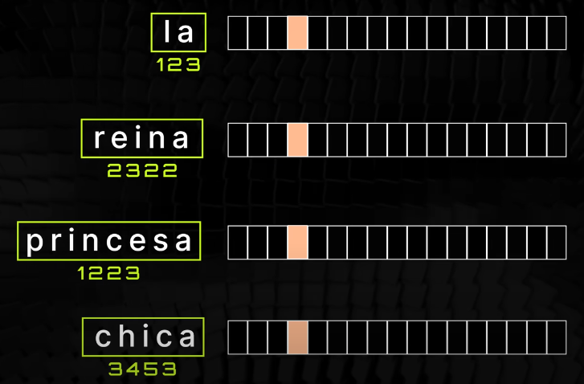
  <br>
  <em>Figura 9: marcación entre tokens </em>
</p>

la idea es seguir sumando marcadores entre distintos token, de esta manera el modelo aunque no sabe exactamente qué significan, sí saber como clasificarlos.

<p align="center">
  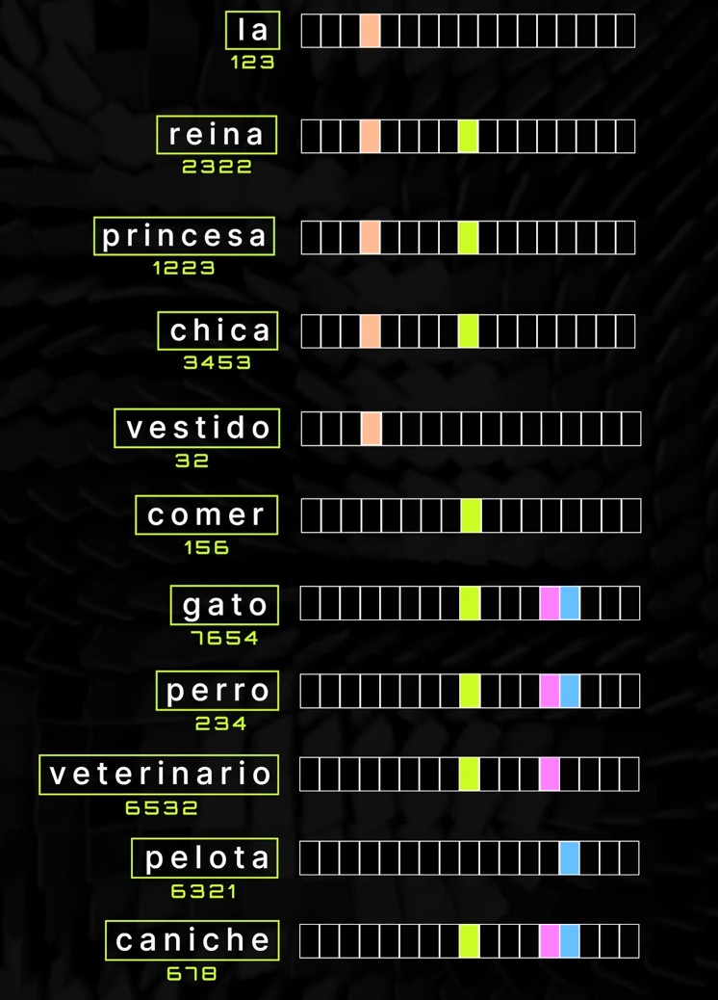
  <br>
  <em>Figura x: Relación entre tokens </em>
</p>

Esto se puede extender hasta **cientos o miles de marcadores** (dimensiones), formando lo que podríamos imaginar como un tipo de **ADN de la palabra** (o del token, en general).

Cada token se representa mediante un **vector numérico de gran dimensión**, donde **cada posición del vector captura una característica o relación aprendida del contexto**. Así, dos tokens con significados o usos similares tendrán vectores parecidos.

> 📌 Nota: aunque en este caso hablamos de "token = palabra", un token también puede ser parte de una palabra o incluso una secuencia de palabras, según el modelo de tokenización utilizado.


<p align="center">
  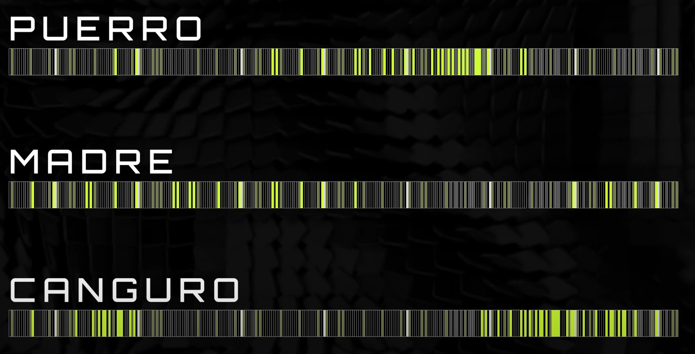
  <br>
  <em>Figura 10: Relación entre tokens </em>
</p>

Otra forma de representar estos vectores es imaginarlos en un **espacio tridimensional**. En la práctica, cada marcador corresponde a una dimensión, por lo que los vectores pueden tener **cientos o miles de dimensiones**. Sin embargo, al proyectarlos en 3D podemos visualizar mejor la **relación de cercanía entre tokens**.

Esta idea de "cercanía semántica" nos permite ver, por ejemplo, que tokens como `"rey"` y `"reina"` están más cerca entre sí que de `"auto"`.

>  Esta representación permite entender cómo el modelo "comprende" las relaciones entre conceptos sin saber realmente qué significan.

 El siguiente ejemplo fue obtenido de [esta herramienta de visualización de embeddings de TensorFlow](https://projector.tensorflow.org/), donde podés explorar estas relaciones en 2D o 3D de forma interactiva.


<p align="center">
  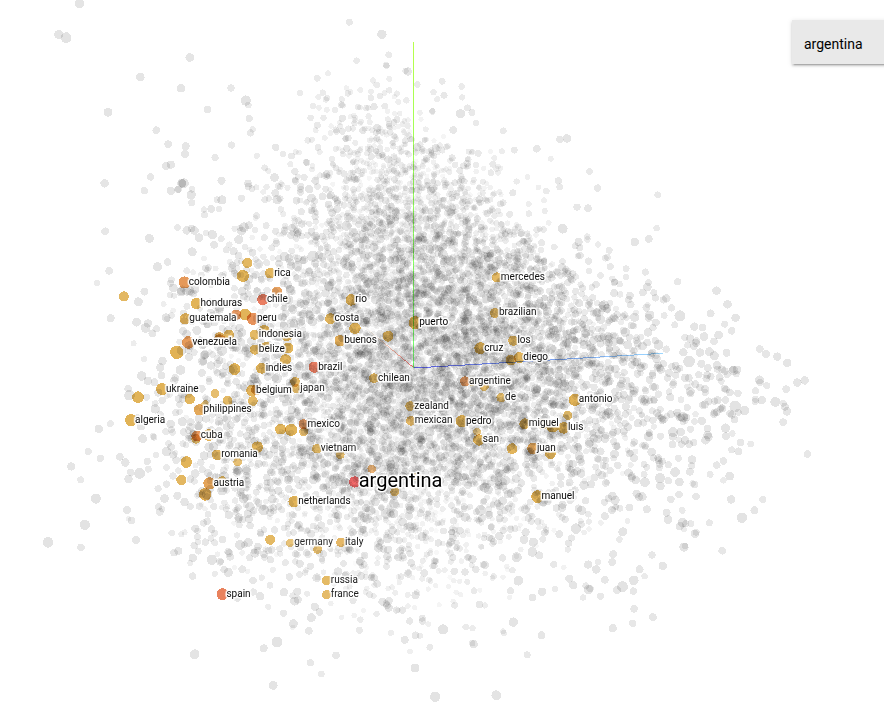
  <br>
  <em>Figura 11: Representación tridimensional embedding </em>
</p>

En este caso, podemos ver que palabras cercanas a "argentina" son:

<p align="center">
  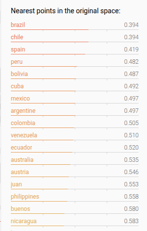
  <br>
  <em>Figura 12: Puntos más cercanos a la palabra "argentina" </em>
</p>

Esto permite realizar operaciones matemáticas entre vectores que representan palabras, también conocidos como *embeddings*. Gracias a esta propiedad, se pueden hacer analogías semánticas, como por ejemplo:

- **"CORONA" + "HOMBRE" ≈ "REY"**
- **"REY" - "HOMBRE" + "MUJER" ≈ "REINA"**

Estos cálculos se basan en relaciones semánticas aprendidas por el modelo a partir de grandes cantidades de texto. Así, los embeddings no solo capturan el significado de las palabras, sino también sus relaciones contextuales.

### 5. Normalización y Lematización

Cuando trabajamos con texto, especialmente al darle instrucciones a una IA, hay muchos términos que no aportan valor significativo. Palabras como **"la", "lo", "el", "y", "con"**, o incluso los **signos de puntuación**, suelen ser irrelevantes para el análisis, ya que aparecen en casi todos los contextos y no cambian el significado central de una frase.

Para simplificar y optimizar el procesamiento, lo primero que hacemos es **limpiar** los textos antes de pasarlos al sistema. Veamos un ejemplo con la frase:

> **"El gato está durmiendo en el sofá."**

1. **Frase original:**  
   `"El gato está durmiendo en el sofá."`

2. **Eliminación de palabras irrelevantes y signos de puntuación:**  
   `"gato está durmiendo sofá"`

3. **Lematización (reducción de las palabras a su forma base):**  
   `"gato es dormir sofá"`

4. **Tokenización (división en unidades básicas):**  
   `"gato", "dormir", "sofá"`

Esta frase queda **comprimida** y más eficiente para el procesamiento por parte del modelo. En lugar de trabajar con muchas palabras y tokens innecesarios, esta versión reduce el texto a su **mínima expresión útil**, acelerando la búsqueda y el análisis dentro del modelo.

Modelos como ChatGPT **preparan internamente nuestra entrada** de esta forma para compararla con representaciones (embeddings) similares y generar una respuesta adecuada. Este proceso implica una **pérdida de información**, ya que comprimimos el mensaje original. Sin embargo, esto no es algo negativo: la IA no repite textualmente, sino que genera una **respuesta original** basada en la comprensión del contenido.

> Un buen ejemplo sería escuchar una clase y al día siguiente explicarle el concepto a alguien más: no recordamos todas las palabras exactas, pero sí entendemos y transmitimos la idea principal.

### 6. Sampling

El *sampling* (muestreo) es una técnica que permite al modelo generar respuestas de forma más **variada y creativa**, introduciendo un **componente aleatorio** en el proceso de generación de texto.

En lugar de elegir siempre la palabra más probable según el modelo, el sampling permite explorar otras opciones que, aunque sean ligeramente menos probables, siguen siendo **coherentes** dentro del contexto. Es como moverse ligeramente dentro del **espacio de embeddings**, eligiendo caminos diferentes que llevan a respuestas distintas pero igualmente válidas.

> Esto evita que el modelo siempre dé las mismas respuestas ante los mismos inputs y permite generar resultados más **naturales y diversos**, sin perder el sentido general de la conversación.

## Evolución de las Redes Neuronales

Las redes neuronales tradicionales tienen una gran limitación: **no tienen memoria**. Es decir, procesan cada entrada (input) de manera aislada, sin recordar lo que pasó antes. Pero, ¿cómo puede una red entender el contexto de una conversación o el significado completo de una frase si solo ve una palabra a la vez?

### Redes Neuronales Recurrentes (RNN)

Para resolver este problema apareció una arquitectura llamada **Red Neuronal Recurrente** (RNN), que introduce la idea de "memoria" al alimentar el resultado de un paso como entrada del siguiente.

- Procesan palabra por palabra en **secuencia**.
- Cada palabra se analiza considerando lo anterior.
- Problema: **pierden contexto** cuando el texto es muy largo.
- No permiten **paralelizar**, por lo que el entrenamiento es más lento.

<p align="center">
  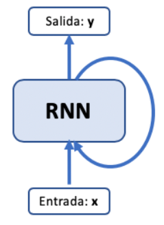
  <br>
  <em>Figura 13: Ejemplo de RNN </em>
</p>

### LSTM (Long Short-Term Memory)

Las **LSTM** son una mejora de las RNN tradicionales. Introducen una especie de "filtro de memoria" que decide qué información mantener y cuál olvidar.

- Manejan mejor el contexto de largo plazo.
- Son más precisas que las RNN simples.
- Aun así, siguen siendo **secuenciales** y **no paralelizables**, lo que limita su eficiencia.


## El Gran Cambio: Transformers

El gran salto llegó en 2017 con el paper [**“Attention is All You Need”**](https://arxiv.org/abs/1706.03762), que introdujo el modelo **Transformer**. Esta arquitectura cambió por completo la forma en que las redes procesan secuencias.

### ¿Qué aportan los Transformers?

- Utilizan un mecanismo llamado **Self-Attention** para identificar la importancia de cada palabra en relación con todas las demás, **en paralelo**.
- Permiten analizar **todas las palabras al mismo tiempo**, no de forma secuencial.
- Esto facilita el entrenamiento y mejora la comprensión del **contexto completo**.
- Son **altamente paralelizables**, lo que acelera enormemente el proceso.

### Ejemplo con Self-Attention

En la frase:

> “La vida es bella, así que vívela cada día.”

El modelo analiza cada palabra en relación con todas las demás. Por ejemplo:

- "la" con respecto a "vida", "bella", "vívela", etc.
- "vida" con respecto a todas las demás también.

<p align="center">
  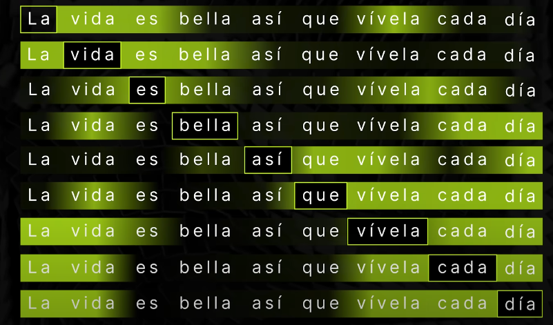
  <br>
  <em>Figura 14: Ejemplo de uso de transformers </em>
</p>

<p align="center">
  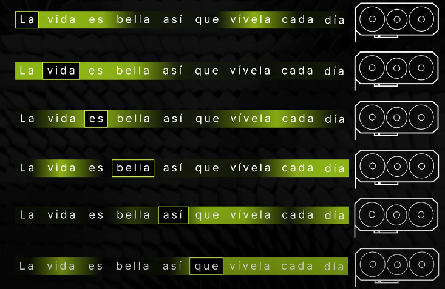
  <br>
  <em>Figura 15: Ejemplo de paralelización </em>
</p>

Esto permite entender cuáles son las palabras más importantes para construir el significado global de la frase, incluso si están separadas por otras palabras.

Gracias a los Transformers, hoy podemos contar con modelos como GPT, BERT y otros LLM (Large Language Models) que comprenden mejor el lenguaje y generan respuestas más coherentes, rápidas y útiles.


---


Bibliografía:

https://www.youtube.com/watch?v=FdZ8LKiJBhQ&list=PL3ei_Xb7-ic5pkJDTplPxWvE8t13mm19W&index=8
https://www.ntiva.com/blog/what-is-machine-learning
Aurélien Géron - Hands-On Machine Learning with Scikit-Learn, Keras and TensorFlow
http://personal.cimat.mx:8181/~mrivera/cursos/aprendizaje_profundo/RNN_LTSM/introduccion_rnn.html
https://visajourneypro.com/
https://projector.tensorflow.org/
https://arxiv.org/abs/1706.03762