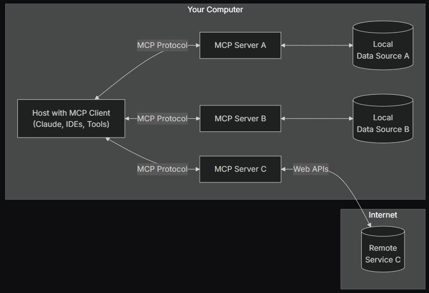

https://www.anthropic.com/news/model-context-protocol
https://modelcontextprotocol.io/introduction

---

  

# ¿Qué es el Model Context Protocol (MCP)?

Es un estándar abierto diseñado para mejorar la interoperabilidad y la transparencia en el uso de modelos de inteligencia artificial, especialmente los modelos de lenguaje. MCP fue presentado por Anthropic y otros colaboradores de la industria con el objetivo de facilitar la integración, el control y la comprensión de cómo los modelos procesan y utilizan el contexto proporcionado por los usuarios y las aplicaciones.

MCP es un protocolo abierto que estandariza cómo las aplicaciones proporcionan contexto a los LLMs. Se puede pensar en MCP como el puerto USB-C para las aplicaciones de IA: así como el USB-C ofrece una forma estandarizada de conectar dispositivos a diferentes periféricos y accesorios, MCP proporciona una forma estandarizada de conectar modelos de IA a distintas fuentes de datos y herramientas.

  
   
  <em>Figura 1: "Antes y después de MCP"</em>

## Objetivos principales del MCP

1. **Interoperabilidad y flexibilidad:** Permite la conexión directa con integraciones preconstruidas y facilita el intercambio entre diferentes proveedores de LLMs, estandarizando la forma en que los modelos y aplicaciones comparten información contextual.

2. **Transparencia y control:** Estandariza la descripción y transmisión del contexto a los modelos, permitiendo a usuarios y desarrolladores entender mejor qué información se utiliza en cada interacción, mientras mantiene los datos dentro de la infraestructura propia.

3. **Seguridad y cumplimiento:** Permite especificar y auditar qué datos se incluyen en el contexto, mejorando la privacidad y el cumplimiento de normativas mediante mejores prácticas de seguridad.

## Arquitectura general de MCP

En esencia, MCP sigue una arquitectura cliente-servidor donde una aplicación anfitriona puede conectarse a múltiples servidores:

  
   
  <em>Figura 2: "Arquitectura general de MCP"</em>

- **MCP Hosts:** Programas como Claude Desktop, IDEs o herramientas de IA que desean acceder a datos a través de MCP.
- **MCP Clients:** Clientes de protocolo que mantienen conexiones 1:1 con los servidores.
- **MCP Servers:** Programas ligeros que exponen capacidades específicas mediante el protocolo MCP estandarizado.
- **Fuentes de datos locales:** Archivos, bases de datos y servicios de tu computadora a los que los servidores MCP pueden acceder de forma segura.
- **Servicios remotos:** Sistemas externos disponibles en internet (por ejemplo, a través de APIs) a los que los servidores MCP pueden conectarse.

---

## Referencias

- Anthropic. (2024). [Model Context Protocol](https://www.anthropic.com/news/model-context-protocol)
- Model Context Protocol. (2024). [Introduction](https://modelcontextprotocol.io/introduction)
- Model Context Protocol. (2024). [GitHub Repository](https://github.com/modelcontextprotocol)
