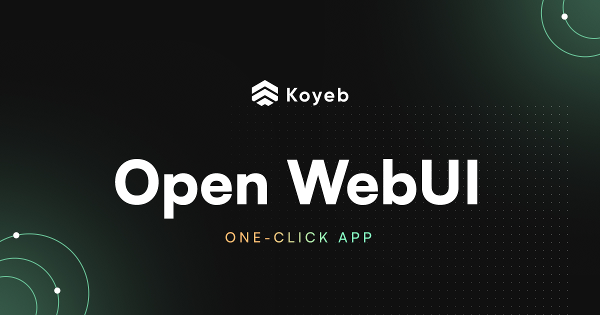

## Evaluación de Interfaces de Usuario para el Agente de IA

Una parte esencial del sistema consiste en definir cómo el usuario final interactúa con el agente de inteligencia artificial integrado mediante n8n. A continuación, se presentan distintas interfaces consideradas, evaluando su facilidad de implementación, flexibilidad, experiencia de usuario y compatibilidad con el enfoque actual del proyecto.

### Opciones evaluadas:

| Interfaz                  | Tipo       | Requiere Backend Propio | Personalizable | Experiencia de Usuario | Observaciones |
|---------------------------|------------|--------------------------|----------------|------------------------|---------------|
| **Webstudio.is**          | Web builder visual | No                       | Limitada       | Alta                   | Ideal para sitios estáticos. Poco flexible para flujos IA dinámicos. |
| **UXPilot.ai**            | Plataforma No-code IA | No                    | Baja           | Alta                   | Orientada a formularios rápidos. No admite lógica compleja o flujos con herramientas como n8n. |
| **Wix**                   | Web builder | No (con Velo opcional)   | Media          | Media-Alta             | Compatible con Webhooks de n8n, pero limitado en backend y escalabilidad. |
| **Streamlit**             | Python App | Sí                       | Alta           | Alta                   | Ideal para visualizaciones rápidas, pero requiere levantar servidor externo. |
| **CLI (línea de comandos)** | Terminal  | No                       | Alta           | Baja                   | Útil para pruebas técnicas, no apta para usuarios finales. |
| **HTML + fetch + Webhook** | Web simple | No                       | Media          | Media                  | Implementación rápida, pero no escala bien sin backend intermedio. |
| **OpenWebUI**             | Web UI local + API | No (self-hosted)        | Alta           | Alta                   | Interfaz amigable, pensada para servir como frontend de agentes IA. Integrable con Ollama/n8n fácilmente. |

---

### Elección final: `✅ OpenWebUI`

  

  
   
  <em>Figura 1: "Ejemplo de uso de OpenWebUI"</em>

Se opta por utilizar **OpenWebUI** como interfaz de interacción con el agente por las siguientes razones:

- **Autohospedada y local**: Compatible con la filosofía del proyecto basada en infraestructura local y control de datos.
- **Diseñada para IA**: Ofrece una experiencia tipo "chat" optimizada para trabajar con modelos como LLaMA, Mistral u Ollama sin necesidad de desarrollos frontend desde cero.
- **Integración simple con n8n**: Se puede conectar a flujos de n8n mediante API, Webhooks o enrutar consultas directamente desde la interfaz de chat.
- **Buena experiencia de usuario**: Presenta una interfaz limpia, intuitiva y personalizable.
- **Escalable**: Admite múltiples usuarios, historial de conversaciones y ajustes por backend, permitiendo su evolución a futuro.

---

> **Nota**: En fases futuras podría integrarse OpenWebUI con funcionalidades adicionales de seguimiento, contexto conversacional avanzado o dashboards específicos para análisis de papers, según la evolución del agente.

# Referencias

- [Webstudio.is](https://webstudio.is/) - Plataforma de desarrollo web visual
- [UXPilot.ai](https://uxpilot.ai/) - Constructor de interfaces de IA sin código
- [Wix](https://www.wix.com/) - Constructor de sitios web con opciones de desarrollo
- [Streamlit](https://streamlit.io/) - Framework para crear aplicaciones web con Python
- [OpenWebUI](https://github.com/open-webui/open-webui) - Interfaz web de código abierto para Ollama
- [n8n](https://n8n.io/) - Plataforma de automatización de flujos de trabajo
- [Ollama](https://ollama.ai/) - Framework para ejecutar modelos de lenguaje localmente
- [OpenWebUI Tutorial](https://www.youtube.com/watch?v=6zn8vVTeFE0) - Video tutorial sobre la configuración y uso de OpenWebUI
- [OpenWebUI n8n Pipe](https://openwebui.com/f/coleam/n8n_pipe) - integración entre OpenWebUI y n8n
- [OpenWebUI Documentation](https://docs.openwebui.com/) - Documentación oficial de OpenWebUI