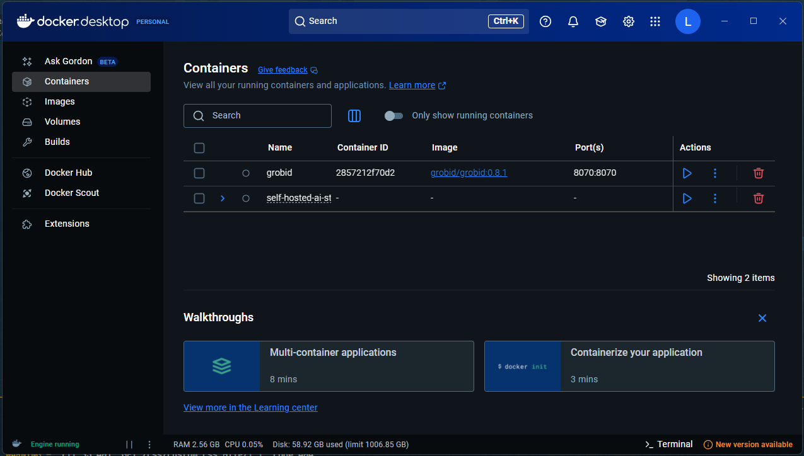
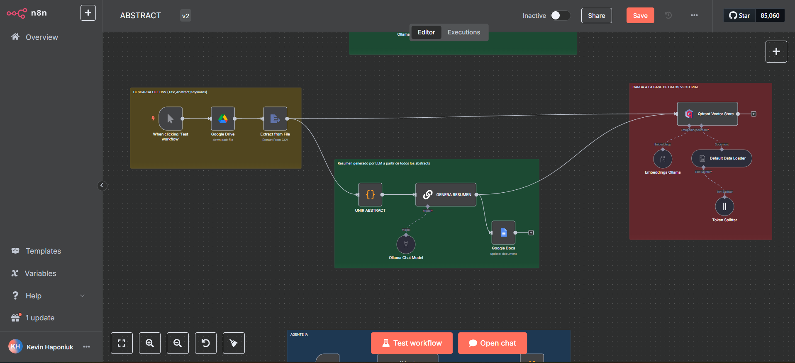

# Instalación de n8n con Self-hosted AI Starter Kit

<p align="center">
  
  <br>
  <em>Figura 1: Self-hosted AI Starter Kit</em>
</p>

Para instalar **n8n** en un entorno local, utilizaremos el **Self-hosted AI Starter Kit**, una plantilla open-source basada en Docker Compose que permite desplegar rápidamente un entorno completo de desarrollo low-code e inteligencia artificial.

## ¿Qué es el Self-hosted AI Starter Kit?

El Self-hosted AI Starter Kit es un conjunto de herramientas preconfiguradas que facilita la instalación y puesta en marcha de n8n junto a otros servicios útiles para proyectos de automatización e IA. Incluye:

- **n8n**: Plataforma low-code con más de 400 integraciones y componentes avanzados de IA.
- **Ollama**: Plataforma para ejecutar modelos de lenguaje (LLM) localmente.
- **Qdrant**: Vector store de alto rendimiento, ideal para búsquedas semánticas y almacenamiento de embeddings.
- **PostgreSQL**: Base de datos robusta y ampliamente utilizada en ingeniería de datos.


---

## Pasos de instalación

### 1. Clonar el repositorio

```bash
git clone https://github.com/n8n-io/self-hosted-ai-starter-kit.git
cd self-hosted-ai-starter-kit
```

### 2. Ejecutar con Docker Compose

Dependiendo de tu hardware, elige la opción adecuada:

#### a) Usuarios con GPU Nvidia

```bash
docker compose --profile gpu-nvidia up
```

#### b) Usuarios con GPU AMD (Linux)

```bash
docker compose --profile gpu-amd up
```

#### c) Usuarios de Mac / Apple Silicon

> **Nota:** En Mac con procesadores M1 o superiores, no es posible exponer la GPU a Docker. Hay dos alternativas:
> - Ejecutar todo el entorno en CPU (ver siguiente sección).
> - Instalar Ollama directamente en tu Mac para inferencia más rápida y conectar n8n a ese servicio.

Para instalar Ollama en Mac, consulta la [página oficial de Ollama](https://ollama.com/).

Para levantar el entorno en CPU:

```bash
docker compose up
```

#### d) Para todos los demás (CPU)

```bash
docker compose --profile cpu up
```

### 3. Visualización mediante docker desktop

Se utilizará docker desktop para la visualización y ejecución del entorno.

<p align="center">
  
  <br>
  <em>Figura 2: Visualización de docker desktop</em>
</p>

donde podremos observar los contenedores que se están ejecutando.

<p align="center">
  
  <br>
  <em>Figura 3: Visualización de contenedores</em>
</p>

Una vez que los contenedores estén en ejecución, podrás acceder a la interfaz web de n8n a través de tu navegador utilizando la siguiente URL:

[http://localhost:5678](http://localhost:5678)

> **Nota**: Asegúrate de que el puerto 5678 no esté siendo utilizado por otra aplicación en tu sistema.

Una vez que inicies sesión, podrás acceder a la interfaz principal de n8n. En la imagen se muestra un ejemplo de un flujo de trabajo configurado. Si has llegado a este punto y puedes ver la interfaz, significa que n8n está correctamente instalado y listo para comenzar a crear tus propios flujos de trabajo.

<p align="center">
  
  <br>
  <em>Figura 4: Interfaz de n8n</em>
</p>

## Instalaciones / Dependencias necesarias

### Instalación de modelos en Ollama

Primero, es necesario instalar las dependencias necesarias para poder ejecutar los ejemplos.

vamos a usar en ollama un modelo de embeddings que se llama `nomic-embed-text` y un modelo de lenguaje que se llama `llama3.1:8b`. para instalarlos, debemos buscarlos en la página de ollama.

- [Repositorio de nomic-embed-text](https://ollama.com/library/nomic-embed-text)

de esta página, podemos seleccionar la versión que queramos instalar.

```bash
ollama pull nomic-embed-text
```

con este comando vamos a ir al docker desktop y vamos a pegarlo en esta sección "Exec".

<p align="center">
  
  <br>
  <em>Figura 5: Instalación de nomic-embed-text</em>
</p>

de manera similar, podemos instalar el modelo de lenguaje `llama3.1:8b`

- [Repositorio de llama3.1:8b](https://ollama.com/library/llama3.1:8b)

```bash
ollama pull llama3.1:8b
```

### Credenciales de Google

Para vincular servicios de Google con n8n, necesitamos seguir estos pasos:

1. Primero, necesitamos crear un proyecto en Google Cloud Console y habilitar las APIs que queremos usar:

      - Ve a [Google Cloud Console](https://console.cloud.google.com/)
      - Crea un nuevo proyecto o selecciona uno existente
      - En el menú lateral, ve a "APIs y servicios" > "Biblioteca"
      - Busca y habilita las APIs que necesites (por ejemplo, "Google Drive API", "Google Docs API")

2. Crear credenciales OAuth 2.0:

      - En el menú lateral, ve a "APIs y servicios" > "Credenciales"
      - Haz clic en "Crear credenciales" > "ID de cliente de OAuth"
      - Selecciona "Aplicación web" como tipo de aplicación
      - Agrega los URIs de redirección autorizados:
        - `http://localhost:5678/rest/oauth2-credential/callback`
      - Guarda el ID de cliente y el secreto del cliente

3. En n8n:

      Para configurar las credenciales de Google, simplemente abre el nodo que necesitas conectar (por ejemplo, si es Google Drive, arrastra el nodo "Google Drive" a tu flujo de trabajo). Luego, haz clic en el nodo y ve a la pestaña "Credenciales". Aquí verás los campos que necesitas completar:

      - OAuth Redirect URL: `http://localhost:5678/rest/oauth2-credential/callback`
      - Client ID: El ID de cliente que obtuviste de Google Cloud Console
      - Client Secret: El secreto del cliente que obtuviste de Google Cloud Console

      Una vez que ingreses estos datos, n8n manejará automáticamente la configuración OAuth2 necesaria para la autenticación.

4. Una vez configuradas las credenciales, podrás usarlas en tus flujos de trabajo de n8n para interactuar con los servicios de Google.

<p align="center">
  
  <br>
  <em>Figura 6: Credenciales de Google</em>
</p>

> **Nota**: Asegúrate de mantener seguras tus credenciales y no compartirlas públicamente. También es importante configurar correctamente los URIs de redirección para que la autenticación funcione correctamente.


## Referencias

- [Repositorio oficial de Self-hosted AI Starter Kit](https://github.com/n8n-io/self-hosted-ai-starter-kit)

- [Repositorio oficial de Ollama](https://ollama.com/)

- [Repositorio de nomic-embed-text](https://ollama.com/library/nomic-embed-text)

- [Repositorio de llama3.1:8b](https://ollama.com/library/llama3.1:8b)

